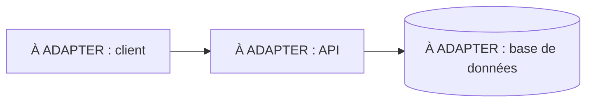
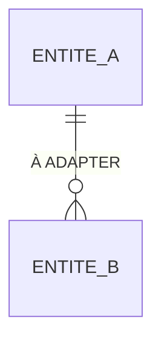

# Architecture technique

Comment le produit est construit : composants, données, contrats, sécurité et infrastructure. Ce document décrit l'état actuel. Le pourquoi de chaque choix est dans un ADR de `docs/adr/`, et les règles métier sont dans [`cahier-des-charges-fonctionnel.md`](cahier-des-charges-fonctionnel.md).

Il est mis à jour dans la PR qui change ce qu'il décrit : modèle de données, contrat, sécurité, infrastructure, ou ADR accepté. Une section sans objet pour le projet reste, avec « Sans objet » et une phrase d'explication.

## Vue d'ensemble

À ADAPTER : les composants, ce que chacun fait, et comment ils communiquent.

## Modèle de données

À ADAPTER : les entités, leurs relations et leurs contraintes. Les noms sont ceux du glossaire du cahier des charges.

| Entité | Contraintes et invariants | Règle métier |
| --- | --- | --- |
| À ADAPTER | | RMn |

## Contrats entre composants

Les composants ne communiquent que par ces contrats. Le fichier de contrat fait foi ; ce tableau dit où il se trouve et qui en dépend. Un changement de contrat exige une spec.

| Contrat | Producteur | Consommateurs | Format | Fichier |
| --- | --- | --- | --- | --- |
| À ADAPTER | | | OpenAPI, MCP… | |

## Conventions d'API

À ADAPTER : nommage des routes, format des erreurs, pagination, versionnement, dates. Si un ADR les fixe, le résumer et renvoyer vers lui.

## Sécurité

- **Identification** : À ADAPTER (qui s'identifie, comment).
- **Droits** : À ADAPTER (comment sont appliqués les droits décrits dans « Acteurs et droits » du cahier des charges).
- **Audit** : À ADAPTER (ce qui est journalisé : qui, quoi, quand).
- **Secrets** : À ADAPTER (où ils vivent ; jamais dans le dépôt, seul `.env.example` est versionné).

## Infrastructure

- **Lancement local** : À ADAPTER (commande, services démarrés).
- **Environnements** : À ADAPTER.
- **CI** : À ADAPTER (workflows, jobs requis sur `main`).
- **Déploiement** : À ADAPTER.

## Décisions d'architecture

| ADR | Titre | Statut |
| --- | --- | --- |
| À ADAPTER | | proposé, accepté, remplacé |
